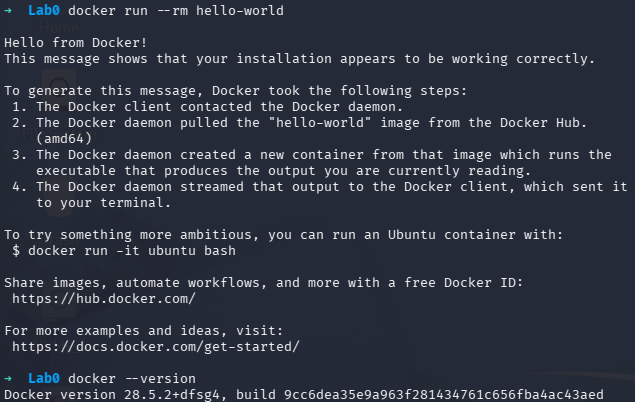
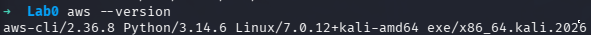
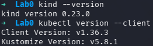
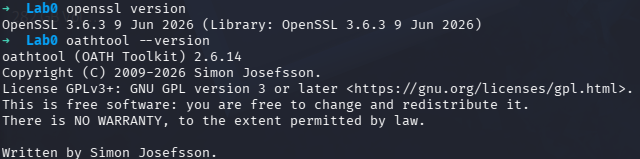
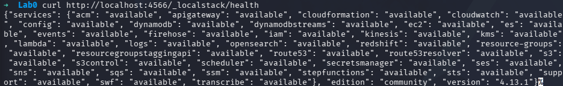
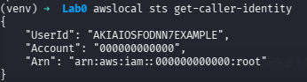
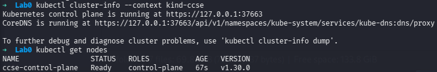

# IKB42603 – Cloud Computing Security Essentials

## Objective

Prepare the local environment for Lab 0 by installing and verifying the required tools for Cloud Computing Security Essentials. This includes Docker, AWS CLI v2, kind, kubectl, LocalStack, and a Kubernetes cluster, as well as configuring AWS CLI for LocalStack usage.

## Tools Installed

- Docker
- AWS CLI v2
- kind (Kubernetes IN Docker)
- kubectl
- LocalStack (legacy Docker image `localstack/localstack:4.13.1`)
- OpenSSL (verification)
- oathtool (optional, recommended for Lab 4)
- awslocal (optional convenience wrapper)

## Step-by-Step Setup

### 1. Install Docker

Commands:

```bash
sudo apt install -y docker.io
sudo systemctl enable docker --now
sudo usermod -aG docker $USER
```

Verification:

```bash
docker --version
docker run --rm hello-world
```

Screenshot:



---

### 2. Install AWS CLI v2

Commands:

```bash
curl "https://awscli.amazonaws.com/awscli-exe-linux-x86_64.zip" -o "awscli2.zip"
unzip awscli2.zip
sudo ./aws/install
```

Verification:

```bash
aws --version
```

Screenshot:



---

### 3. Install kind and kubectl

Commands:

```bash
curl -Lo ./kind https://kind.sigs.k8s.io/dl/v0.23.0/kind-linux-amd64
chmod +x ./kind
sudo mv ./kind /usr/local/bin/kind

curl -LO "https://dl.k8s.io/release/$(curl -L -s https://dl.k8s.io/release/stable.txt)/bin/linux/amd64/kubectl"
chmod +x kubectl
sudo mv kubectl /usr/local/bin/
```

Verification:

```bash
kind --version
kubectl version --client
```

Screenshot:



---

### 4. Install Helper Tools (optional but recommended)

Commands:

```bash
openssl version
sudo apt update
sudo apt install oathtool -y
```

Verification:

```bash
oathtool --version
```

Screenshot:



---

### 5. Start LocalStack

Commands:

```bash
docker run -d --name localstack -p 4566:4566 localstack/localstack:4.13.1
sleep 15
curl http://localhost:4566/_localstack/health
```

Verification:

- Confirm LocalStack returns JSON with services listed as "available".

Screenshot:



---

### 6. Configure AWS CLI for LocalStack

Commands:

```bash
aws configure set aws_access_key_id test
aws configure set aws_secret_access_key test
aws configure set region us-east-1
export EP='--endpoint-url=http://localhost:4566'
aws $EP sts get-caller-identity
```

Verification:

- `aws $EP sts get-caller-identity`
- Expected output includes `UserId`, `Account`, and `Arn`.

Screenshot:



---

### 7. Create a Kubernetes Cluster with kind

Commands:

```bash
kind create cluster --name ccse
mkdir -p ~/.kube
sudo kind get kubeconfig --name ccse > ~/.kube/config
sudo chown $USER:$USER ~/.kube/config
chmod 600 ~/.kube/config
kubectl config use-context kind-ccse
kubectl get nodes
```

Verification:

- `kubectl config get-contexts`
- `kubectl config use-context kind-ccse`
- `kubectl get nodes` should show one node with `STATUS Ready`.

Screenshot:



---

### 8. Optional: Install awslocal

Commands:

```bash
pip install awscli-local
```

Verification:

```bash
awslocal sts get-caller-identity
```

---

## Troubleshooting

- Docker permission errors:
  - Add your user to the `docker` group: `sudo usermod -aG docker $USER`
  - Log out and log in again, or run `newgrp docker`.
  - Use `sudo` for Docker commands if needed.

- LocalStack health check returns `{}` or empty data:
  - Wait 10–15 seconds and retry.
  - Confirm the LocalStack container is running: `docker ps | grep localstack`.

- kind cluster creation fails due to permissions:
  - Run `sudo kind create cluster --name ccse`.
  - Ensure `/usr/local/bin/kind` is executable.

- kubeconfig permission issues:
  - Run `chmod 600 ~/.kube/config`.
  - Fix ownership with `sudo chown $USER:$USER ~/.kube/config`.

- AWS CLI commands fail for LocalStack:
  - Ensure `EP='--endpoint-url=http://localhost:4566'` is set.
  - Confirm LocalStack is accessible at `http://localhost:4566`.

- kubectl context missing:
  - Run `kubectl cluster-info --context kind-ccse`.
  - Re-run `kind get kubeconfig --name ccse > ~/.kube/config` if needed.

---

## Verification Checklist

- [ ] `docker --version`
- [ ] `docker run --rm hello-world`
- [ ] `aws --version`
- [ ] `kind --version`
- [ ] `kubectl version --client`
- [ ] `curl http://localhost:4566/_localstack/health`
- [ ] `aws $EP sts get-caller-identity`
- [ ] `kubectl get nodes`
