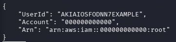
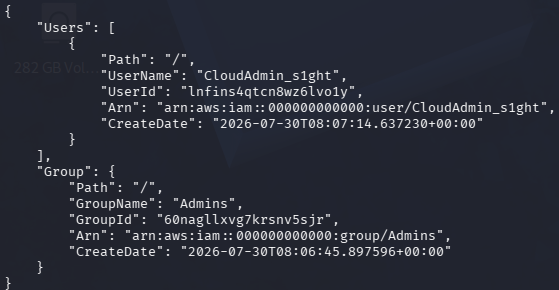
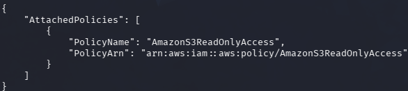
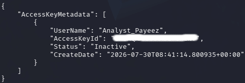
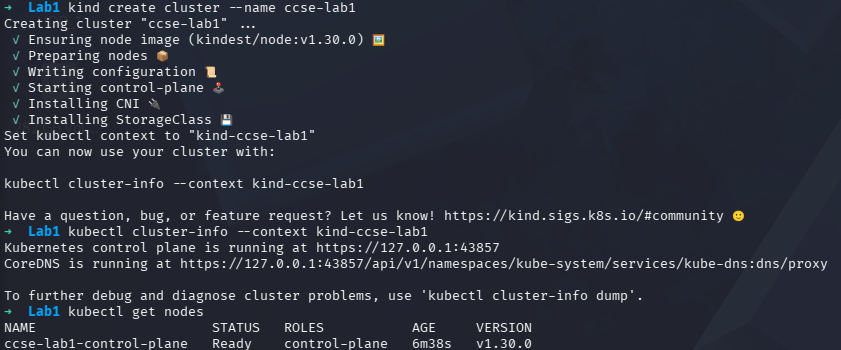
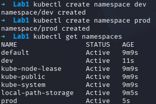
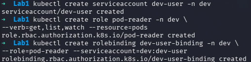
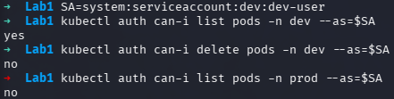
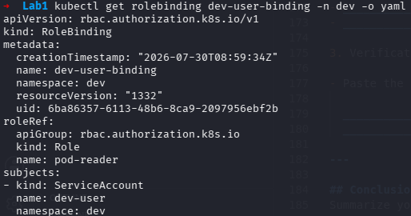

# Lab 1 Report

Date: 30/07/2026

## Objective
Document the Lab1 tasks, record the observed steps, include the commands used, and leave answer spaces for the guided questions.

---
| Concept            | AWS term   | Purpose |
|--------------------|------------|--------------------------|
| All-powerful owner | Root user  | The have the complete control of the system, mainly to create account, set up the config and set the services to be use. |
| Human/app identity | IAM User   | It is for employees, administrators and developers. It allows people to safely log in, manage cloud settingsand make manual approvals. |
| Permission bundle  | IAM Policy | A document written in JSON that defines permissions. Purpose is to secure cloud environment by strict the control, access and change to digital tools and data |
| Collection of users| IAM Group  | A collection of IAM users. It main purpose is to simplify permission management, save administrative time and ensure consisytency. |
| Temporary identity | IAM Role   | A set of permissions that admin cat temporarily set to user, application or services so they can safely access your AWS resources. Its main purpose is to provide temporary security credentials without the need to store long-term passwords or hardcode secret keys inside your code or servers. |


---

## Step 1: One-time environment setup and identity verification
- Description: Verify the current AWS identity using `aws sts get-caller-identity`.
- Command:
  ```bash
  aws sts get-caller-identity
  ```
- Observations:
  - Confirm the returned `UserId`, `Account`, and `Arn` for the active user.




---

## Step 2: Create or verify Admin group
- Description: Verify the Admin IAM group exists and confirm its name.
- Command:
  ```bash
  aws iam get-group --group-name Admins
  ```
- Observations:
  - The Admins group should represent administrative access in the AWS account.



---

## Step 3: Enforce least privilege
- Description: Ensure users and groups have only the permissions they need.
- Command:
  ```bash
  aws iam list-attached-user-policies --user-name Analyst_YOURNAME
  ```
- Observations:
  - Review attached policies and remove any unnecessary privileges.

Question 1:
If the Analyst account were stolen, why is the damage limited compared to a
stolen admin account? Connect your answer to blast-radius reduction.

Answer: The damage is limited because its blast radius is tightly restricted by the principle of least privilege. Unlike a stolen admin account, it has an unlimited blast radius spanning the entire AWS infrastructure.



---

## Step 4: Credential hygiene and access keys
- Description: Review AWS access key hygiene and inspect access key metadata.
- Command:
  ```bash
  aws iam list-access-keys --user-name Analyst_YOURNAME
  ```
- Observations:
  - Identify inactive or stale access keys and keep only necessary keys active.



---

## Step 5: Local Kubernetes cluster setup
- Description: Create the local Kubernetes cluster and verify the cluster context.
- Commands:
  ```bash
  kind create cluster --name ccse-lab1
  kubectl cluster-info --context kind-ccse-lab1
  ```
- Observations:
  - Confirm `kind` cluster creation and control-plane readiness.



---

## Step 6: Separate the environments
- Description: Create the `dev` and `prod` namespaces in the Kubernetes cluster.
- Commands:
  ```bash
  kubectl create namespace dev
  kubectl create namespace prod
  kubectl get namespaces
  ```
- Observations:
  - Use separate namespaces to isolate development and production resources.



---

## Step 7: Define role and bind
- Description: Create a Kubernetes Role for pod read access and bind it to the `dev-user` service account.
- Commands:
  ```bash
  kubectl create serviceaccount dev-user -n dev
  kubectl create role pod-reader -n dev --verb=get,list,watch --resource=pods
  kubectl create rolebinding dev-user-binding -n dev --role=pod-reader --serviceaccount=dev:dev-user
  ```
- Observations:
  - Verify the role and role binding are created in the `dev` namespace.




---

## Step 8: Test access control
- Description: Test the service account's permissions using `kubectl auth can-i`.
- Commands:
  ```bash
  kubectl auth can-i list pods -n dev --as=system:serviceaccount:dev:dev-user
  kubectl auth can-i delete pods -n dev --as=system:serviceaccount:dev:dev-user
  kubectl auth can-i list pods -n prod --as=system:serviceaccount:dev:dev-user
  ```
- Observations:
  - Confirm allowed and denied actions for `dev-user` in `dev` and `prod` namespaces.



Question 2:
Which step is the service account passing, and which step is blocking the delete and the prod access?
- Answer: The service account passing should be in "list pods -n dev" step. The steps that is blocking the delete is the role definition itself. And the steps that blocking the prod access command is the RoleBinding scope.

---

## Deliverables & Assessment

1. Screenshots
- Output of `sts get-caller-identity` showing your operating identity.
- `get-group Admins` output showing your CloudAdmin user as a member.
- `list-attached-user-policies` for the Analyst showing only the read-only policy.
- The three `kubectl auth can-i` results (`YES`, `NO`, `NO`).

2. Short-Answer Questions

Q1. Why is attaching policies to groups better than attaching them directly to users?
- It is better rather than attaching them directly to users because it makes user management much easier. The admin can change the permissions for many people at once rather than update it for each user one by one. 

Q2. What is the difference between an IAM User and an IAM Role?
- IAM User is a permanent identity with long-term credentials, like passwords and access keys, that meant for a specific person or application. IAM Role has no permanent credentials. It is a set of permissions that an entity can temporarily resume.

Q3. Explain least privilege using the Analyst account, and how it reduces blast radius if compromised.
- Least privilege means granting an AWS Analyst account the exactly needed permissions that they required to do the job neccessarily, and nothing more. By implementing this, it can reduce blast radius by prevent data deletion in the selected permissions of data, stops horizontal movement, prevents ransomware and limits data exposure.

Q4. In Kubernetes, what is the difference between a Role and a RoleBinding?
- A Role defines what actions can be performed, while a RoleBinding defines who can perform them.

Q5. Why did the developer service account fail to access prod, and which security principle does that demonstrate?
- The developer service account failed to access production because it was restricted by Kubernetes RBAC to a lower environment and lacked a RoleBinding or ClusterRoleBinding in the prod namespace.

3. Verification Command

- Paste the output of `kubectl get rolebinding dev-user-binding -n dev -o yaml` here:



---

## Conclusion

This lab demonstrated how secure account and identity management reduce risk in AWS and Kubernetes environments. By verifying IAM identities, enforcing least privilege, auditing access keys, and applying Kubernetes RBAC with distinct `dev` and `prod` namespaces, the lab reinforced principles of secure access control and blast-radius reduction.

