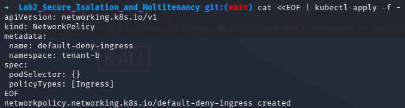
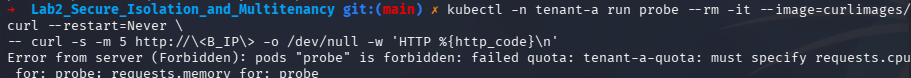
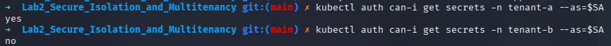
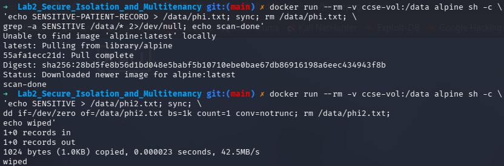

# IKB42603 Lab 2: Secure Isolation and Multitenancy

## Author Name
Syed (s1ght)

## Date
11/08/2026

## Lab Objective
This lab covers secure isolation and multitenancy in Kubernetes by setting up a KinD cluster with Calico networking, creating tenant namespaces, deploying isolated workloads, testing service connectivity, and enforcing resource quotas.

## Environment and Setup
- Host OS: Kali Linux
- Cluster tool: kind
- CNI: Calico
- Kubernetes CLI: kubectl

### Kali Linux Calico Fix
On Kali Linux, Calico installation can fail when the system is using the nftables-backed `iptables` alternative. The issue was resolved by switching `iptables` and `ip6tables` to the legacy backend and flushing existing rules before creating the cluster.

Commands used:
```bash
sudo update-alternatives --set iptables /usr/sbin/iptables-legacy
sudo update-alternatives --set ip6tables /usr/sbin/ip6tables-legacy

sudo iptables -F
sudo iptables -t nat -F
sudo iptables -t mangle -F
sudo iptables -X
```

### Kind Cluster Creation
The KinD cluster was created with default CNI disabled so Calico can be installed cleanly:

```bash
kind delete cluster --name ccse-lab2
cat <<EOF | kind create cluster --name ccse-lab2 --config=-
kind: Cluster
apiVersion: kind.x-k8s.io/v1alpha4
networking:
  disableDefaultCNI: true
  podSubnet: 192.168.0.0/16
EOF
```

Once the cluster was up, Calico was applied successfully:

```bash
kubectl apply -f https://raw.githubusercontent.com/projectcalico/calico/v3.27.0/manifests/calico.yaml
kubectl get pods -n kube-system -l k8s-app=calico-node
```


> Screenshot: `No_1_Setup.png` shows the Calico node running successfully after the Kali Linux iptables fix.

## Session A (Week 3) Completed
The following tasks were completed for Session A (Week): tenant deployment, service exposure, connectivity verification, and resource quota enforcement.

### Task 1: Deploying Tenant Applications
- Created tenant namespaces `tenant-a` and `tenant-b`.
- Deployed an NGINX pod in namespace `tenant-a` as a web application.
- Exposed the deployment as a Kubernetes Service on port 80.

Commands used:
```bash
kubectl -n tenant-a create deployment web --image=nginx
kubectl -n tenant-a expose deployment web --port=80
kubectl -n tenant-b expose deployment web --port=80
kubectl get pods,svc -n tenant-a
```


> Screenshot: `No_2_Task1.png` documents the deployment and service creation in namespace `tenant-a`.

### Task 2: Connectivity Test and Probe
- Retrieved the ClusterIP of the `web` service in `tenant-a`.
- Ran a temporary probe pod in `tenant-a` using `curlimages/curl`.
- Verified HTTP connectivity with a `200` response.

Commands used:
```bash
kubectl -n tenant-a get svc web -o jsonpath='{.spec.clusterIP}'; echo
kubectl -n tenant-a run probe --rm -it --image=curlimages/curl --restart=Never -- /bin/sh -c "curl -s -m 5 http://<SERVICE_CLUSTER_IP> -o /dev/null -w 'HTTP %{http_code}\n'"
```


> Screenshot: `No_3_Task2.png` shows the connectivity check and successful HTTP probe result.

### Task 3: Applying Resource Quota
- Created a resource quota in namespace `tenant-a`.
- Enforced limits on CPU, memory, and pod count.
- Confirmed quota creation and current usage.

Resource quota manifest:
```yaml
apiVersion: v1
kind: ResourceQuota
metadata:
  name: tenant-a-quota
  namespace: tenant-a
spec:
  hard:
    requests.cpu: "1"
    requests.memory: 512Mi
    pods: "5"
```

Commands used:
```bash
kubectl apply -f - <<EOF
apiVersion: v1
kind: ResourceQuota
metadata:
  name: tenant-a-quota
  namespace: tenant-a
spec:
  hard:
    requests.cpu: "1"
    requests.memory: 512Mi
    pods: "5"
EOF
kubectl describe resourcequota tenant-a-quota -n tenant-a
```


> Screenshot: `No_4_Task3.png` confirms the resource quota was created and shows the usage values.

## Summary
- Setup completed successfully on Kali Linux after applying the legacy `iptables` fix.
- Calico CNI was installed and the `calico-node` pod reached `Running`.
- Session A (Week) tasks were completed through deployment, service exposure, connectivity testing, and resource quota enforcement.
- This report is captured in `README.md` with screenshots attached to each task.

## Session B (Week 4) Completed
The following tasks were completed for Session B (Week 4): default-deny network isolation, storage/secret isolation, and data remanence demonstration.

### Task 4: Default-Deny Network Isolation
- Applied a default-deny ingress `NetworkPolicy` to `tenant-b` so cross-tenant ingress is blocked.
- Re-ran the same probe from `tenant-a` and observed that the probe could no longer reach `tenant-b` (timeout / failure).

Commands used:
```bash
cat <<EOF | kubectl apply -f -
apiVersion: networking.k8s.io/v1
kind: NetworkPolicy
metadata:
  name: default-deny-ingress
  namespace: tenant-b
spec:
  podSelector: {}
  policyTypes: [Ingress]
EOF

# Re-run the probe from tenant-a (replace <B_IP>)
kubectl -n tenant-a run probe --rm -it --image=curlimages/curl --restart=Never -- /bin/sh -c "curl -s -m 5 http://<B_IP> -o /dev/null -w 'HTTP %{http_code}\n'"
```




> Screenshots: `No_5_Task4.png` shows the NetworkPolicy creation; `No_6_Task4.png` shows the probe timing out / failing after the policy.

### Task 5: Storage & Secret Isolation
- Created per-tenant secrets and a service account scoped to `tenant-a`.
- Verified `kubectl auth can-i` shows `yes` for reading secrets in `tenant-a` and `no` for `tenant-b` when impersonating the tenant-a service account.

Commands used:
```bash
kubectl -n tenant-a create secret generic data --from-literal=value=SECRET_A
kubectl -n tenant-b create secret generic data --from-literal=value=SECRET_B

kubectl -n tenant-a create serviceaccount app-a
kubectl -n tenant-a create role reader --verb=get --resource=secrets
kubectl -n tenant-a create rolebinding rb --role=reader --serviceaccount=tenant-a:app-a
SA=system:serviceaccount:tenant-a:app-a
kubectl auth can-i get secrets -n tenant-a --as=$SA
kubectl auth can-i get secrets -n tenant-b --as=$SA
```



> Screenshot: `No_7_Task5.png` shows `yes` for `tenant-a` and `no` for `tenant-b` when impersonating the tenant-a service account.

### Task 6: Data Remanence & Secure Deletion
- Demonstrated that deleted files in a Docker volume may leave residual bytes and then performed an overwrite (secure wipe) before deletion.

Commands used:
```bash
docker run --rm -v ccse-vol:/data alpine sh -c \
 'echo SENSITIVE-PATIENT-RECORD > /data/phi.txt; sync; rm /data/phi.txt; \ 
 grep -a SENSITIVE /data/* 2>/dev/null; echo scan-done'

docker run --rm -v ccse-vol:/data alpine sh -c \
 'echo SENSITIVE > /data/phi2.txt; sync; \
 dd if=/dev/zero of=/data/phi2.txt bs=1k count=1 conv=notrunc; rm /data/phi2.txt; echo wiped'
```



> Screenshots: `No_8_Task6.png` shows the scan finding residual content; Below it shows the overwrite/wipe output.

## Short-Answer Questions (with concise answers)

Q1. Why can containers in different namespaces reach each other by default, and why is that dangerous in multi-tenant cloud?
- A1: Namespaces are a logical grouping, not a network boundary. By default, Kubernetes allows cluster-internal pod networking, so tenants can reach each other which risks data exfiltration and lateral movement.

Q2. Explain the default-deny principle and how your NetworkPolicy implements it.
- A2: Default-deny means block all traffic unless explicitly allowed; the `NetworkPolicy` with empty `podSelector` and `policyTypes: [Ingress]` denies all ingress to pods in the namespace.

Q3. How do virtual machines and containers differ in isolation strength? When would you add a VM boundary?
- A3: VMs provide stronger isolation via separate kernels and hardware abstraction. Use a VM boundary when tenants require strong security, compliance, or untrusted workloads.

Q4. What is data remanence, and why is cryptographic erasure the preferred cloud solution?
- A4: Data remanence is leftover recoverable data after deletion. Cryptographic erasure (destroying encryption keys) is preferred because cloud providers abstract physical storage and it is efficient and reliable.

Q5. Which of the three isolation dimensions (compute, network, storage) did each task exercise?
- A5: Task 1 = compute (namespaces/containers), Task 2 = network (default-open proof), Task 3 = compute/resource quotas, Task 4 = network (NetworkPolicy), Task 5 = storage (secrets/RBAC), Task 6 = storage (remanence/wipe).

## Verification Commands
kubectl get networkpolicy -A
kubectl describe resourcequota tenant-a-quota -n tenant-a

