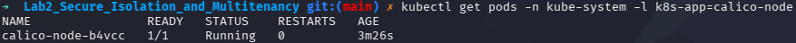
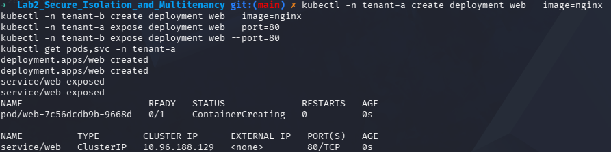
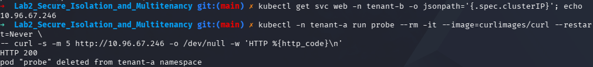
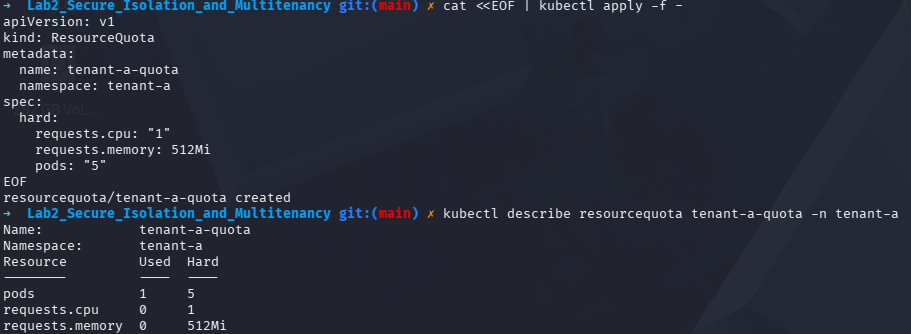

# IKB42603 Lab 2: Secure Isolation and Multitenancy

## Author Name
Name: Syed (s1ght)

## Lab Objective
This lab covers secure isolation and multitenancy in Kubernetes by setting up a KinD cluster with Calico networking, creating tenant namespaces, deploying isolated workloads, testing service connectivity, and enforcing resource quotas.

## Environment and Setup
- Host OS: Kali Linux
- Cluster tool: kind
- CNI: Calico
- Kubernetes CLI: kubectl

### Kali Linux Calico Fix
On Kali Linux, Calico installation can fail when the system is using the nftables-backed `iptables` alternative. The issue was resolved by switching `iptables` and `ip6tables` to the legacy backend and flushing existing rules before creating the cluster.

Commands used:
```bash
sudo update-alternatives --set iptables /usr/sbin/iptables-legacy
sudo update-alternatives --set ip6tables /usr/sbin/ip6tables-legacy

sudo iptables -F
sudo iptables -t nat -F
sudo iptables -t mangle -F
sudo iptables -X
```

### Kind Cluster Creation
The KinD cluster was created with default CNI disabled so Calico can be installed cleanly:

```bash
kind delete cluster --name ccse-lab2
cat <<EOF | kind create cluster --name ccse-lab2 --config=-
kind: Cluster
apiVersion: kind.x-k8s.io/v1alpha4
networking:
  disableDefaultCNI: true
  podSubnet: 192.168.0.0/16
EOF
```

Once the cluster was up, Calico was applied successfully:

```bash
kubectl apply -f https://raw.githubusercontent.com/projectcalico/calico/v3.27.0/manifests/calico.yaml
kubectl get pods -n kube-system -l k8s-app=calico-node
```



> Screenshot: `No_1_Setup.png` shows the Calico node running successfully after the Kali Linux iptables fix.

## Session A (Week 3) Completed
The following tasks were completed for Session A (Week): tenant deployment, service exposure, connectivity verification, and resource quota enforcement.

### Task 1: Deploying Tenant Applications
- Created tenant namespaces `tenant-a` and `tenant-b`.
- Deployed an NGINX pod in namespace `tenant-a` as a web application.
- Exposed the deployment as a Kubernetes Service on port 80.

Commands used:
```bash
kubectl -n tenant-a create deployment web --image=nginx
kubectl -n tenant-a expose deployment web --port=80
kubectl -n tenant-b expose deployment web --port=80
kubectl get pods,svc -n tenant-a
```



> Screenshot: `No_2_Task1.png` documents the deployment and service creation in namespace `tenant-a`.

### Task 2: Connectivity Test and Probe
- Retrieved the ClusterIP of the `web` service in `tenant-a`.
- Ran a temporary probe pod in `tenant-a` using `curlimages/curl`.
- Verified HTTP connectivity with a `200` response.

Commands used:
```bash
kubectl -n tenant-a get svc web -o jsonpath='{.spec.clusterIP}'; echo
kubectl -n tenant-a run probe --rm -it --image=curlimages/curl --restart=Never -- /bin/sh -c "curl -s -m 5 http://<SERVICE_CLUSTER_IP> -o /dev/null -w 'HTTP %{http_code}\n'"
```



> Screenshot: `No_3_Task2.png` shows the connectivity check and successful HTTP probe result.

### Task 3: Applying Resource Quota
- Created a resource quota in namespace `tenant-a`.
- Enforced limits on CPU, memory, and pod count.
- Confirmed quota creation and current usage.

Resource quota manifest:
```yaml
apiVersion: v1
kind: ResourceQuota
metadata:
  name: tenant-a-quota
  namespace: tenant-a
spec:
  hard:
    requests.cpu: "1"
    requests.memory: 512Mi
    pods: "5"
```

Commands used:
```bash
kubectl apply -f - <<EOF
apiVersion: v1
kind: ResourceQuota
metadata:
  name: tenant-a-quota
  namespace: tenant-a
spec:
  hard:
    requests.cpu: "1"
    requests.memory: 512Mi
    pods: "5"
EOF
kubectl describe resourcequota tenant-a-quota -n tenant-a
```



> Screenshot: `No_4_Task3.png` confirms the resource quota was created and shows the usage values.

## Summary
- Setup completed successfully on Kali Linux after applying the legacy `iptables` fix.
- Calico CNI was installed and the `calico-node` pod reached `Running`.
- Session A (Week) tasks were completed through deployment, service exposure, connectivity testing, and resource quota enforcement.
- This report is captured in `README.md` with screenshots attached to each task.
