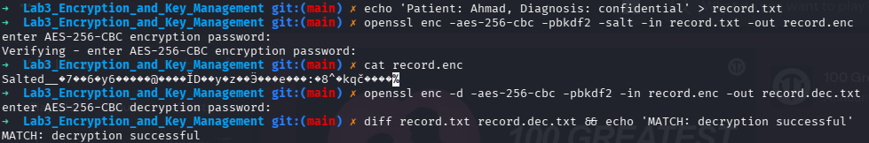
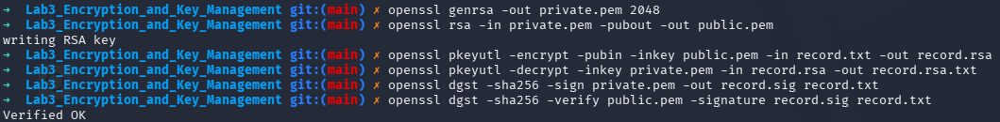
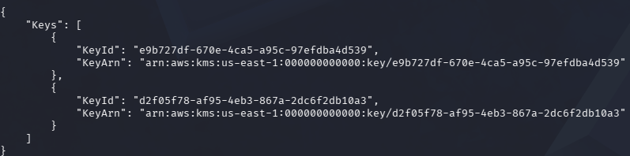
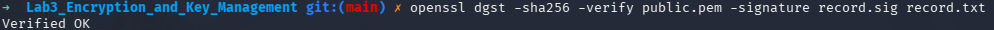

# IKB42603 Cloud Computing Security Essentials
## Lab 3 - Data Protection: Encryption & Key Management

**Name:** Syed (s1ght)  
**Date:** 20 August 2026

---

## 1. Objective

This lab demonstrates practical data protection techniques across two sessions:

- Symmetric AES encryption for data at rest.
- Asymmetric RSA encryption and digital signatures.
- TLS encryption for data in transit.
- LocalStack KMS key creation and direct encryption.
- Envelope encryption using a KMS-wrapped data key.
- Per-tenant keys and cryptographic erasure.
- SHA-256 integrity checks and a tamper-evident hash chain.

## 2. Learning Outcomes

At the end of this lab, the student is able to:

1. Encrypt and decrypt data using AES and RSA cryptography.
2. Protect data in transit using TLS.
3. Use KMS and implement envelope encryption.
4. Apply per-tenant keys and demonstrate cryptographic erasure.
5. Verify integrity with hashing and hash chains.

## 3. Environment

| Component | Details |
|---|---|
| Operating system | Linux |
| Encryption tools | OpenSSL and SHA-256 |
| Container runtime | Docker |
| KMS | LocalStack at `http://localhost:4566` |
| CLI | AWS CLI v2 |
| Web server | nginx Docker container |
| Sample record | `record.txt` containing `Patient: Ahmad, Diagnosis: confidential` |

## 4. Step-by-Step Implementation

### Session A (Week 5) - Encryption Fundamentals

#### Task 1 - Symmetric Encryption (Data at Rest)

AES-256-CBC uses one shared secret for encryption and decryption. PBKDF2 derives the encryption key from the passphrase.

```bash
echo 'Patient: Ahmad, Diagnosis: confidential' > record.txt
openssl enc -aes-256-cbc -pbkdf2 -salt -in record.txt -out record.enc
cat record.enc
openssl enc -d -aes-256-cbc -pbkdf2 -in record.enc -out record.dec.txt
diff record.txt record.dec.txt && echo 'MATCH: decryption successful'
```

The encrypted file is unreadable as plaintext, and the decrypted file matches the original.



#### Task 2 - Asymmetric Encryption and Digital Signatures

RSA uses a public/private key pair. The public key encrypts, the private key decrypts, and the private key signs while the public key verifies.

```bash
openssl genrsa -out private.pem 2048
openssl rsa -in private.pem -pubout -out public.pem
openssl pkeyutl -encrypt -pubin -inkey public.pem -in record.txt -out record.rsa
openssl pkeyutl -decrypt -inkey private.pem -in record.rsa -out record.rsa.txt
openssl dgst -sha256 -sign private.pem -out record.sig record.txt
openssl dgst -sha256 -verify public.pem -signature record.sig record.txt
```

The verification output was `Verified OK`.



#### Task 3 - Encryption in Transit (TLS)

A self-signed certificate was generated and used by nginx to serve the record over HTTPS.

```bash
openssl req -x509 -newkey rsa:2048 -keyout key.pem -out cert.pem \
	-days 7 -nodes -subj '/CN=localhost'
docker run --rm -d --name tls -p 8443:443 \
	-v $(pwd)/cert.pem:/etc/nginx/cert.pem \
	-v $(pwd)/key.pem:/etc/nginx/key.pem \
	-v $(pwd)/record.txt:/usr/share/nginx/html/record.txt nginx
curl -k https://localhost:8443/record.txt
docker stop tls
```

The HTTPS request returned `Patient: Ahmad, Diagnosis: confidential`. The `-k` option accepts the self-signed certificate for this lab.


### Session B (Week 6) - KMS, Envelope Encryption, and Erasure

The LocalStack KMS endpoint was configured as follows:

```bash
EP='--endpoint-url=http://localhost:4566'
```

#### Task 4 - Create and Use a KMS Master Key

LocalStack was started and a customer master key was created for Tenant A.

```bash
docker run -d --name localstack -p 4566:4566 localstack/localstack
aws $EP kms create-key --description 'CCSE tenant-A master key'
KEY_A=<PASTE_KEYID>
aws $EP kms encrypt --key-id $KEY_A --plaintext "$(echo -n 'hello' | base64)" --query CiphertextBlob --output text
```

The KMS response returned a key identifier and a Base64-encoded ciphertext blob.


#### Task 5 - Envelope Encryption

Envelope encryption uses a short-lived data key for the file and stores only the KMS-wrapped version of that key.

```bash
aws $EP kms generate-data-key --key-id $KEY_A --key-spec AES_256 --query '[Plaintext,CiphertextBlob]' --output text
# Save column 1 as datakey.b64 and column 2 as datakey.enc.
base64 -d datakey.b64 > datakey.bin
openssl enc -aes-256-cbc -pbkdf2 -in record.txt -out record.env.enc -pass file:./datakey.bin
rm datakey.bin datakey.b64
echo 'Only the KMS-wrapped data key (datakey.enc) remains.'
```

The plaintext data key was used locally, then removed. The encrypted record and wrapped data key remain.


#### Task 6 - Per-Tenant Keys and Cryptographic Erasure

A separate KMS key was created for Tenant B. Tenant A's key was then scheduled for deletion and disabled so that its wrapped data key could no longer be recovered.

```bash
aws $EP kms create-key --description 'CCSE tenant-B master key'
KEY_B=<PASTE_KEYID>
aws $EP kms schedule-key-deletion --key-id $KEY_A --pending-window-in-days 7
aws $EP kms disable-key --key-id $KEY_A
aws $EP kms decrypt --ciphertext-blob fileb://datakey.enc 2>&1 | head -3
```

The decrypt attempt failed, demonstrating that the disabled Tenant A key could not unwrap the data key.


##### Extra Task 6 Step - Undo Pending Deletion

The pending deletion can be cancelled while the key is still within its waiting period:

```bash
aws --endpoint-url=http://localhost:4566 kms cancel-key-deletion --key-id <KEY_ID>
```

This restores the key from the pending-deletion state. Replace `<KEY_ID>` with the affected key ID.


#### Task 7 - Integrity and Tamper-Evidence

SHA-256 fingerprints were calculated for the original and modified records. A hash chain was then built so each entry depended on the previous entry.

```bash
sha256sum record.txt
cp record.txt tampered.txt
echo 'x' >> tampered.txt
sha256sum record.txt tampered.txt
PREV=0
for line in 'login ok' 'file read' 'export data'; do
	PREV=$(echo -n "$PREV$line" | sha256sum | cut -d' ' -f1)
	echo "$line | $PREV"
done
```

The modified file produced a different SHA-256 hash, and every hash-chain entry included the preceding state.


## 5. Verification Commands

```bash
aws --endpoint-url=http://localhost:4566 kms list-keys
openssl dgst -sha256 -verify public.pem -signature record.sig record.txt
```





## 6. Short-Answer Questions

Q1. Compare symmetric and asymmetric encryption: speed, key distribution, and typical use.

**Answer:** Symmetric encryption is faster and is commonly used for protecting large files. Asymmetric encryption is slower, but it makes key sharing easier because the public key can be shared openly; it is often used for secure key exchange and digital signatures.


Q2. Why is key management described as the weakest link, not the algorithm?

**Answer:** Strong encryption cannot protect data if the key is lost, stolen, or stored insecurely. Attackers usually try to obtain the key instead of breaking the encryption algorithm.


Q3. Explain envelope encryption and why only the master key needs hardware-grade protection.

**Answer:** Envelope encryption uses a data key to encrypt the file, while a master key encrypts or wraps the data key. The data key can be used temporarily, but protecting the master key protects all the wrapped data keys, so it needs stronger hardware-level protection.


Q4. How does cryptographic erasure achieve provable deletion where overwriting cannot in the cloud?

**Answer:** Cryptographic erasure deletes or permanently disables the key needed to decrypt the data. Even if encrypted copies remain in cloud backups or replicas, they cannot be read without that key.


Q5. How does a hash chain make a log tamper-evident?

**Answer:** Each log entry includes a hash of the previous entry. If someone changes an older entry, its hash changes and the later entries no longer match, making the tampering detectable.


## 7. Security Best-Practices Checklist

- [x] Data encrypted at rest with AES and decryption verified.
- [x] Asymmetric keys used correctly: encrypt with public, sign with private.
- [x] Data protected in transit with TLS.
- [x] Envelope encryption used; plaintext data key removed from disk.
- [x] Per-tenant keys and cryptographic erasure demonstrated.
- [x] Integrity verified with SHA-256 and a hash chain.

## 8. Cleanup and Teardown

```bash
docker stop tls 2>/dev/null
rm -f record.* private.pem public.pem key.pem cert.pem datakey.* tampered.txt
docker stop localstack && docker rm localstack
```
```