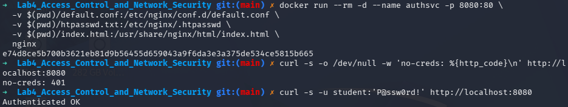
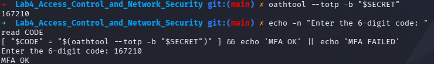
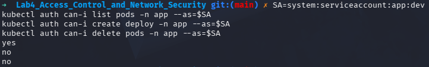
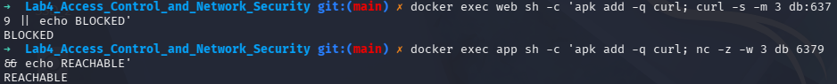
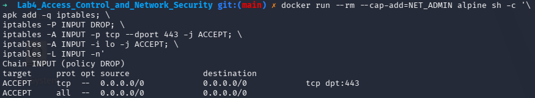
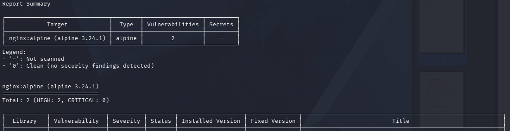

# IKB42603 Cloud Computing Security Essentials
## Lab 4 - Access Control and Network Security

**Name:** Syed (s1ght)  
**Date:** 28 August 2026  
**Environment:** Kali Linux

---

## 1. Objective

This lab demonstrates practical access-control and network-security controls:

- HTTP Basic authentication for a password-protected service.
- Multi-factor authentication using a time-based one-time password (TOTP).
- Kubernetes role-based access control (RBAC) using least privilege.
- Docker network segmentation between frontend, application and database tiers.
- Default-deny firewall rules with explicit allow rules.
- Container hardening using a non-root user, a read-only filesystem, dropped capabilities and `no-new-privileges`.
- Vulnerability scanning with Trivy.

## 2. Learning Outcomes

At the end of this lab, the student is able to:

1. Distinguish authentication from authorization and implement both controls.
2. Add and validate a second authentication factor with TOTP.
3. Enforce least-privilege permissions using Kubernetes RBAC.
4. Segment container networks so services can reach only their required tiers.
5. Apply default-deny firewall rules and harden a container workload.
6. Scan a container image for known vulnerabilities.

## 3. Environment

| Component | Details |
|---|---|
| Operating system | Kali Linux |
| Container runtime | Docker |
| Kubernetes tools | kind and kubectl |
| MFA tool | oathtool |
| Vulnerability scanner | Trivy container image |
| Web service | nginx Docker container |
| Database test service | Redis Alpine Docker container |

## 4. Step-by-Step Implementation

### Session A (Week 7) - Authentication and Authorization

#### Task 1 - Authentication: Password-Protected Service

HTTP Basic authentication was configured in nginx. The service rejects requests without credentials and serves the page only after valid credentials are supplied.

The following commands were used in Kali Linux:

```bash
docker run --rm httpd:alpine htpasswd -nbB student 'P@ssw0rd!' > htpasswd.txt
echo 'Authenticated OK' > index.html

cat > default.conf <<'EOF'
server {
    listen 80;
    location / {
        auth_basic "Restricted";
        auth_basic_user_file /etc/nginx/.htpasswd;
        root /usr/share/nginx/html;
        index index.html;
    }
}
EOF

docker run --rm -d --name authsvc -p 8080:80 \
  -v $(pwd)/default.conf:/etc/nginx/conf.d/default.conf \
  -v $(pwd)/htpasswd.txt:/etc/nginx/.htpasswd \
  -v $(pwd)/index.html:/usr/share/nginx/html/index.html \
  nginx

curl -s -o /dev/null -w 'no-creds: %{http_code}\n' http://localhost:8080
curl -s -u student:'P@ssw0rd!' http://localhost:8080
```

The unauthenticated request returned `401`, while the authenticated request returned `Authenticated OK` with status `200`.



#### Task 2 - Add a Second Factor (MFA / TOTP)

A random Base32 secret was generated and used to produce a six-digit TOTP code. The code was then entered and compared with the current value generated by `oathtool`.

```bash
SECRET=$(head -c 20 /dev/urandom | base32)
echo "Enrol this secret in an authenticator app: $SECRET"
oathtool --totp -b "$SECRET"

echo -n "Enter the 6-digit code: "
read CODE
[ "$CODE" = "$(oathtool --totp -b "$SECRET")" ] && echo 'MFA OK' || echo 'MFA FAILED'
```

The entered code was accepted and the terminal displayed `MFA OK`. MFA combines something the user knows, such as a password, with something the user has, such as an authenticator secret. The secret shown in the screenshot is lab evidence and should not be reused in a real account.



#### Task 3 - Authorization: RBAC Roles

Authentication establishes identity, while authorization determines what that identity is allowed to do. A Kubernetes service account named `dev` was granted only `get` and `list` permissions for pods in the `app` namespace.

```bash
kind create cluster --name ccse-lab4
kubectl create namespace app
kubectl create serviceaccount dev -n app
kubectl create role dev-role -n app --verb=get,list --resource=pods
kubectl create rolebinding dev-rb -n app --role=dev-role --serviceaccount=app:dev

SA=system:serviceaccount:app:dev
kubectl auth can-i list pods -n app --as=$SA
kubectl auth can-i create deploy -n app --as=$SA
kubectl auth can-i delete pods -n app --as=$SA
```

The results were `yes`, `no` and `no`, respectively. This confirms that the developer identity can read pods but cannot create deployments or delete pods.



### Session B (Week 8) - Network Security and Hardening

#### Task 4 - Network Segmentation (Three-Tier)

Two Docker networks were created. The database was placed only on `backend-net`, the application was connected to both networks, and the web tier was placed only on `frontend-net`.

```bash
docker network create frontend-net
docker network create backend-net

docker run -d --name db --network backend-net redis:alpine
docker run -d --name app --network backend-net nginx
docker network connect frontend-net app
docker run -d --name web --network frontend-net nginx

docker exec web sh -c 'apk add -q curl; curl -s -m 3 db:6379 || echo BLOCKED'
docker exec app sh -c 'apk add -q curl; nc -z -w3 db 6379 && echo REACHABLE'
```

The web-to-database request was `BLOCKED`, while the application-to-database test was `REACHABLE`. Therefore, a compromised web container cannot directly access the database network.



#### Task 5 - Firewall Rules (Default-Deny)

A throwaway Alpine container with the `NET_ADMIN` capability was used to model a default-deny firewall. Only TCP port 443 and loopback traffic were explicitly allowed.

```bash
docker run --rm --cap-add=NET_ADMIN alpine sh -c '\
 apk add -q iptables; \
 iptables -P INPUT DROP; \
 iptables -A INPUT -p tcp --dport 443 -j ACCEPT; \
 iptables -A INPUT -i lo -j ACCEPT; \
 iptables -L INPUT -n'
```

The resulting ruleset showed `Chain INPUT (policy DROP)`, an allow rule for TCP destination port 443, and an allow rule for loopback traffic. This is equivalent to the default-deny approach used by cloud security groups: traffic is denied unless an explicit rule permits it.



#### Task 6 - Container Hardening and Vulnerability Scanning

The hardened service was configured to run without root privileges, with a read-only root filesystem, all Linux capabilities dropped, privilege escalation disabled and a writable temporary filesystem limited to `/tmp`.

```bash
docker run -d --name hardened \
  --user 1000:1000 \
  --read-only \
  --cap-drop=ALL \
  --security-opt no-new-privileges \
  --tmpfs /tmp \
  nginxinc/nginx-unprivileged

docker inspect hardened --format 'User={{.Config.User}} ReadOnly={{.HostConfig.ReadonlyRootfs}}'
docker inspect hardened --format '{{json .HostConfig.CapDrop}}'
docker run --rm aquasec/trivy image --severity HIGH,CRITICAL nginx:alpine | head -20
```

The captured Trivy report identified two HIGH vulnerabilities and no CRITICAL vulnerabilities in `nginx:alpine` at the time of scanning. The image should be updated and rescanned before production use.



The main hardening measures and the attacks they blunt are:

| Measure | Attack surface reduced |
|---|---|
| Non-root user | Limits container escape impact and prevents many privileged file and process actions. |
| Read-only root filesystem | Prevents malware or an attacker from persistently modifying the image filesystem. |
| `--cap-drop=ALL` | Removes unnecessary Linux privileges that could support host or kernel abuse. |
| `no-new-privileges` | Prevents processes from gaining additional privileges through setuid or similar mechanisms. |
| Minimal unprivileged image and Trivy scanning | Reduces installed components and identifies known vulnerable packages. |

## 5. Verification Commands

```bash
kubectl get rolebinding dev-rb -n app -o yaml
docker inspect hardened --format '{{json .HostConfig.CapDrop}}'
```

The RoleBinding verification confirms that `dev-rb` binds the `dev-role` to the `app:dev` service account. The container inspection confirms that all capabilities were dropped.

## 6. Short-Answer Questions

### Q1. Explain the difference between authentication and authorization using Tasks 1 and 3.

Authentication verifies who a user or service is. In Task 1, nginx authenticates the request by checking the supplied username and password, returning `401` when credentials are absent. Authorization happens after identity is established and decides what that identity may do. In Task 3, Kubernetes authorizes the `dev` service account to list pods but denies deployment creation and pod deletion.

### Q2. Why is MFA so effective, and which attacks does it defeat?

MFA requires independent factors, so a stolen password alone is insufficient. TOTP can defeat many password-reuse, credential-stuffing, brute-force and phishing attacks when the attacker does not also obtain the current authenticator code. It is less effective against real-time phishing, malware on the authenticator device or stolen recovery methods.

### Q3. How does network segmentation limit the damage of a compromised web server?

Segmentation restricts which network paths exist. The web tier is connected only to `frontend-net`, while the database is connected only to `backend-net`; consequently, the web container cannot resolve or connect directly to the database. This limits lateral movement and reduces the data that can be reached after a web compromise.

### Q4. What does a default-deny firewall policy achieve, and how does it relate to cloud security groups?

A default-deny policy blocks all unsolicited traffic unless an explicit allow rule exists. The test allowed only HTTPS on port 443 and loopback traffic. Cloud security groups use the same least-privilege model by allowing only required inbound or outbound flows and denying the rest.

### Q5. List the hardening measures you applied and the attack surface each one removes.

The container ran as a non-root user, which limits the impact of a process compromise. Its root filesystem was read-only, which blocks persistent file modification. All capabilities were dropped, which removes unnecessary privileged kernel operations. `no-new-privileges` blocks privilege escalation, while the temporary filesystem provides only a controlled writable location. Finally, Trivy scanning identifies known vulnerable packages so the base image can be updated.

## 7. Security Best-Practices Checklist

- [x] Service requires authentication; unauthenticated requests return `401`.
- [x] MFA / second factor implemented and validated with `MFA OK`.
- [x] Authorization enforced by Kubernetes RBAC with least privilege.
- [x] Network segmented so the database is unreachable from the web tier.
- [x] Default-deny firewall policy with explicit allow rules.
- [x] Container hardened with non-root execution, read-only storage, dropped capabilities and no-new-privileges.
- [x] Image scanned for HIGH and CRITICAL vulnerabilities.

## 8. Cleanup and Teardown

```bash
docker rm -f authsvc db app web hardened 2>/dev/null
docker network rm frontend-net backend-net 2>/dev/null
kind delete cluster --name ccse-lab4
```


