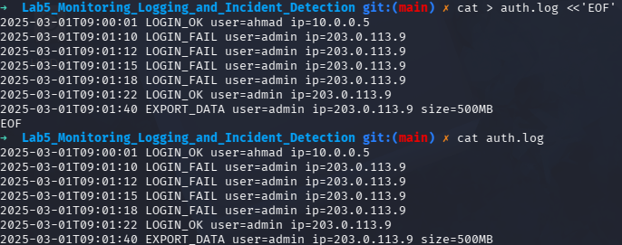
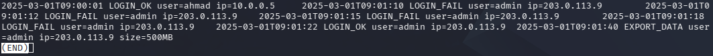
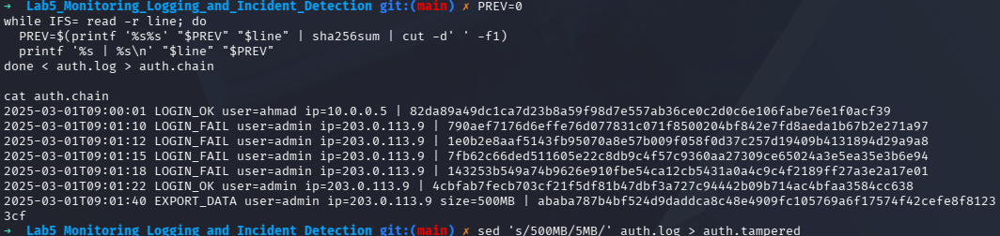
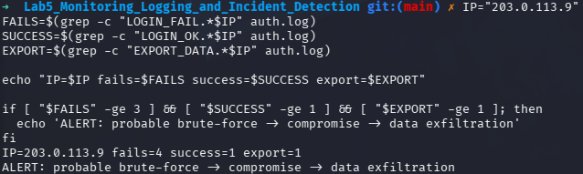
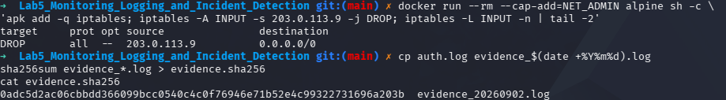
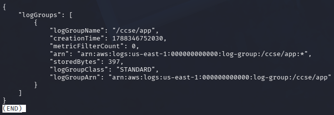

# IKB42603 Cloud Computing Security Essentials
## Lab 5 - Monitoring, Logging and Incident Detection

**Name:** Syed (s1ght)  
**Date:** 2 September 2026  
**Environment:** Kali Linux, Docker, LocalStack and AWS CLI v2

---

## 1. Objective

This lab demonstrates how security telemetry can be collected, centralised, protected against alteration and used to support incident response. The activities covered:

- Generating authentication and data-export application logs.
- Centralising logs in a LocalStack CloudWatch Logs service.
- Querying authentication failures for security-relevant activity.
- Building and verifying a tamper-evident hash-chained log.
- Correlating repeated failures, a successful login and a data export to detect an incident.
- Containing the suspected source and collecting integrity-protected evidence.

## 2. Learning Outcomes

At the end of this lab, the student is able to:

1. Collect and centralise logs from multiple services as cloud telemetry.
2. Distinguish durable logs from real-time security events.
3. Build a tamper-evident log using a cryptographic hash chain.
4. Detect an incident by correlating related authentication and data-access activity.
5. Perform the incident-response steps of detection, containment, evidence collection and documentation.

## 3. Environment

| Component | Details |
|---|---|
| Operating system | Kali Linux |
| Container runtime | Docker |
| Cloud service emulator | LocalStack |
| Cloud logging interface | AWS CLI v2 and CloudWatch Logs API |
| Shell utilities | grep, awk, sha256sum and standard shell tools |
| Log group | `/ccse/app` |
| Log stream | `auth` |

## 4. Step-by-Step Implementation

### Session A (Week 9) - Logging and Centralisation

#### Task 1 - Generate Application Logs

LocalStack was started as a local cloud-service emulator. A CloudWatch Logs group named `/ccse/app` and an `auth` stream were created. The application log records one normal login, four failed login attempts, a later successful login and a large data export from the same external address.

```bash
docker run -d --name localstack -p 4566:4566 localstack/localstack
EP='--endpoint-url=http://localhost:4566'
aws $EP logs create-log-group --log-group-name /ccse/app
aws $EP logs create-log-stream --log-group-name /ccse/app --log-stream-name auth

cat > auth.log <<'EOF'
2025-03-01T09:00:01 LOGIN_OK user=ahmad ip=10.0.0.5
2025-03-01T09:01:10 LOGIN_FAIL user=admin ip=203.0.113.9
2025-03-01T09:01:12 LOGIN_FAIL user=admin ip=203.0.113.9
2025-03-01T09:01:15 LOGIN_FAIL user=admin ip=203.0.113.9
2025-03-01T09:01:18 LOGIN_FAIL user=admin ip=203.0.113.9
2025-03-01T09:01:22 LOGIN_OK user=admin ip=203.0.113.9
2025-03-01T09:01:40 EXPORT_DATA user=admin ip=203.0.113.9 size=500MB
EOF
cat auth.log
```

The generated log provides a chronological record of authentication and data-access activity. The first line is ordinary activity, whereas the later entries form a potentially suspicious sequence.



#### Task 2 - Centralise Logs in CloudWatch Logs

Each line of `auth.log` was submitted to the LocalStack CloudWatch Logs stream with an increasing timestamp. The records were then read back from the central store.

```bash
TS=$(date +%s000)
while IFS= read -r line; do
	aws $EP logs put-log-events --log-group-name /ccse/app --log-stream-name auth \
		--log-events timestamp=$TS,message="$line" >/dev/null
	TS=$((TS+1000))
done < auth.log

aws $EP logs get-log-events --log-group-name /ccse/app --log-stream-name auth \
	--query 'events[].message' --output text
```

The read-back confirmed that the central logging service stored the authentication records, rather than leaving them only on the application host. This centralisation supports monitoring, investigation and later audit review.



#### Task 3 - Query Security-Relevant Activity

Failed authentication attempts were filtered and grouped by source address.

```bash
grep LOGIN_FAIL auth.log | awk '{print $4, $5}' | sort | uniq -c
```

The log contains **four failed logins from `203.0.113.9`**. A log is the durable record of each attempt; an event is a meaningful trigger derived from one or more records, such as an alert for four failures from the same address.


### Session B (Week 10) - Tamper-Proofing, Detection and Response

#### Task 4 - Tamper-Proof Hash-Chained Logs

Each log line was combined with the previous hash and processed with SHA-256. The resulting chain makes later modification detectable because changing one line changes its hash and all subsequent hashes.

```bash
PREV=0
while IFS= read -r line; do
	PREV=$(printf '%s%s' "$PREV" "$line" | sha256sum | cut -d' ' -f1)
	printf '%s | %s\n' "$line" "$PREV"
done < auth.log > auth.chain
cat auth.chain

sed 's/500MB/5MB/' auth.log > auth.tampered
```

The original chain was generated successfully. After changing the export size from `500MB` to `5MB`, recomputing the chain produced a different final hash. Therefore, the alteration was detected. The final hash should be stored separately in an append-only or otherwise trusted location so that an attacker who can modify the application log cannot also rewrite the integrity reference.



#### Task 5 - Detect the Incident Through Correlation

The authentication failures, successful login and data export were correlated for the suspicious address.

```bash
IP=203.0.113.9
FAILS=$(grep -c "LOGIN_FAIL.*$IP" auth.log)
SUCCESS=$(grep -c "LOGIN_OK.*$IP" auth.log)
EXPORT=$(grep -c "EXPORT_DATA.*$IP" auth.log)
echo "IP=$IP fails=$FAILS success=$SUCCESS export=$EXPORT"

if [ "$FAILS" -ge 3 ] && [ "$SUCCESS" -ge 1 ] && [ "$EXPORT" -ge 1 ]; then
	echo 'ALERT: probable brute-force -> compromise -> data exfiltration'
fi
```

The output was `IP=203.0.113.9 fails=4 success=1 export=1`, followed by the alert. No individual line proves the complete incident. Correlation identifies the larger sequence: repeated probing, probable account compromise and suspicious data exfiltration.



#### Task 6 - Incident Response

The suspected source address was contained by modelling an input firewall rule in an Alpine container. The original log was then copied to a timestamped evidence file and hashed.

```bash
docker run --rm --cap-add=NET_ADMIN alpine sh -c \
	'apk add -q iptables; iptables -A INPUT -s 203.0.113.9 -j DROP; iptables -L INPUT -n | tail -2'

cp auth.log evidence_$(date +%Y%m%d).log
sha256sum evidence_*.log > evidence.sha256
cat evidence.sha256
```

The containment output showed a `DROP` rule for `203.0.113.9`. The evidence hash was recorded for `evidence_20260902.log`, allowing the file to be checked later with `sha256sum -c evidence.sha256`.



## 5. Incident Report

### Detection

The incident was detected by querying the centralised authentication log and correlating activity from `203.0.113.9`. Four failed administrator logins were followed by a successful administrator login and a `500MB` export. The correlation rule generated an alert for probable brute-force activity followed by compromise and data exfiltration.

### Analysis

The sequence is consistent with an attacker probing the administrator account, eventually obtaining valid credentials and exporting a substantial volume of data. Although the individual log entries are not independently conclusive, their order, common source address and timing provide a strong security signal.

### Containment

The source address `203.0.113.9` was blocked with an `iptables` input `DROP` rule. In a production environment, this action would be applied through the organisation's approved firewall, security group or incident-response automation, with care taken to avoid blocking legitimate shared infrastructure.

### Evidence & Integrity

The centralised read-back, failed-login query, hash chain, tampered copy, correlation output and containment output were retained as evidence. An evidence copy named `evidence_20260902.log` was created and its SHA-256 digest was stored in `evidence.sha256`. Recomputing the hash chain after changing `500MB` to `5MB` produced a different final hash, proving that the modification was detectable.

### Lesson Learned

Centralised and tamper-evident logging should be established before an incident occurs. Logs should also be forwarded to a separately protected, append-only location, because an attacker who controls an application host may otherwise be able to alter both the event records and the local integrity evidence.

## 6. Short-Answer Questions

### Q1. What is the difference between a log and an event? Give an example of each from this lab.

A **log** is a durable, timestamped record of an occurrence. For example, `2025-03-01T09:01:10 LOGIN_FAIL user=admin ip=203.0.113.9` is a log entry. An **event** is a significant occurrence or trigger identified from one or more records, often used to initiate an alert or response. In this lab, `alert: 4 failures from 203.0.113.9` is an example of a security event derived from the log entries.

### Q2. Why must audit logs be tamper-proof, and how does a hash chain achieve this?

Audit logs support detection, forensic reconstruction and compliance. If an attacker can edit them, they can conceal unauthorised access or make the timeline unreliable. A hash chain includes the previous hash when calculating the current hash. Consequently, changing one record changes its hash and invalidates every subsequent link. Comparing the recomputed final hash with a trusted stored value reveals the alteration.

### Q3. How did correlation detect an incident that no single log line revealed?

The correlation process combined three related conditions for the same IP address: at least three failed logins, at least one successful login and at least one data export. The resulting pattern of four failures, one success and one `500MB` export indicated a probable brute-force attack followed by account compromise and exfiltration. No single entry contained that complete interpretation.

### Q4. List the incident-response steps you performed and the goal of each.

1. **Detect:** queried and correlated the logs to identify the suspicious sequence.
2. **Contain:** added a firewall `DROP` rule for `203.0.113.9` to prevent further connections from the suspected source.
3. **Collect evidence:** created a timestamped copy of the original log and recorded its SHA-256 hash.
4. **Verify integrity:** used the hash chain and evidence digest to detect later modification.
5. **Document:** recorded the detection, analysis, containment action, evidence and lesson learned in an incident report.

### Q5. How do the same logs serve both security monitoring and compliance evidence?

For security monitoring, logs provide near-real-time visibility into failed logins, successful authentication and data exports. They can be queried and correlated to generate alerts. For compliance, the same records provide an auditable history showing who accessed a service, when activity occurred and what actions followed. Centralisation, retention, access control and tamper-evident integrity checks increase their reliability as evidence during audits or investigations.

## 7. Verification Commands

```bash
aws --endpoint-url=http://localhost:4566 logs describe-log-groups
sha256sum -c evidence.sha256
```

The LocalStack query confirmed the `/ccse/app` log group. The evidence verification command confirmed that the recorded SHA-256 digest matched the timestamped evidence file.



## 8. Security Best-Practices Checklist

- [x] Logs were centralised in a CloudWatch Logs-compatible service.
- [x] Failed-login activity was queried and grouped by IP address.
- [x] Log integrity was made tamper-evident using a hash chain.
- [x] The incident was detected by correlating multiple related records.
- [x] The suspected source was contained with a firewall rule.
- [x] Evidence was copied, hashed and documented.
- [x] A short incident report and timeline analysis were completed.

## 9. Cleanup and Teardown

```bash
rm -f auth.log auth.chain auth.tampered evidence_*.log evidence.sha256
docker stop localstack && docker rm localstack
```
