# Lab 6 Report: Object Storage Security and Data Lifecycle

## 1. Introduction

This report documents the implementation of Lab 6 using the LocalStack environment in Kali Linux. The original tutorial commands were not fully compatible with the LocalStack environment used in this workspace, so I reproduced the same security workflow using the command sequence that was successfully executed in the terminal. The purpose of the lab was to explore the full object-storage data lifecycle: classification, exposure, bucket policy control, deny-by-default policy evaluation, encryption, presigned URLs, credential-delegation constraints, versioning, delete markers, lifecycle automation and cryptographic erasure.

The exercises were performed in the LocalStack S3 and IAM simulation environment. The reporting structure follows the workflow in the IKB42603 Lab 6 tutorial and answers the questions requested in the official teaching instruction.

---

## 2. Environment Setup

The commands below were used to start LocalStack and prepare the AWS CLI for all tasks.

```sh
# start LocalStack
localstack

# if a container exists
# docker rm -f localstack 2>/dev/null
# docker run -d --name localstack -p 4566:4566 \
#   -e LOCALSTACK_AUTH_TOKEN=$LOCALSTACK_AUTH_TOKEN \
#   -e ENFORCE_IAM=1 \
#   localstack/localstack-pro:latest

export EP='--endpoint-url=http://localhost:4566'
aws configure set aws_access_key_id test
aws configure set aws_secret_access_key test
aws configure set region us-east-1
aws $EP sts get-caller-identity
```

### Command result

The successful LocalStack identity confirmed the endpoint and dummy account value:

```json
{
  "UserId": "000000000000",
  "Account": "000000000000",
  "Arn": "arn:aws:iam::000000000000:root"
}
```

The account number is important because it is reused when writing account-scoped ARNs in resource policies.

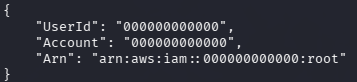

---

## 3. Task 1 — Data Classification and Object Storage

### Objective

Create a new bucket and store three objects with different sensitivities. The objects were:

- public object: public-notice.txt
- internal object: internal-roster.txt
- confidential object: confidential-record.txt

### Kali Linux Commands

```sh
export BUCKET=miit-patient-records-$RANDOM
echo $BUCKET
aws $EP s3api create-bucket --bucket $BUCKET

echo 'Ward visiting hours 10am-8pm' > public-notice.txt
echo 'Staff duty schedule, week 12' > internal-roster.txt
echo 'Patient: Ahmad bin Ali, Diagnosis: confidential' > confidential-record.txt

aws $EP s3api put-object --bucket $BUCKET --key public/notice.txt \
--body public-notice.txt --tagging 'classification=public'

aws $EP s3api put-object --bucket $BUCKET --key internal/roster.txt \
--body internal-roster.txt --tagging 'classification=internal'

aws $EP s3api put-object --bucket $BUCKET --key confidential/record.txt \
--body confidential-record.txt --tagging 'classification=confidential'

aws $EP s3api list-objects-v2 --bucket $BUCKET --query 'Contents[].[Key,Size]' --output table
aws $EP s3api get-object-tagging --bucket $BUCKET --key confidential/record.txt
```

### Screenshot evidence

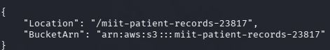

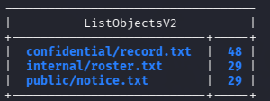

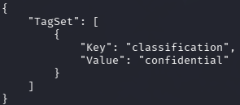

### Classification table

| Classification | Who may read it | Impact if leaked | Control later applied |
|---|---|---|---|
| public | public audience | low impact, public information | public notice is stored without sensitive restrictions |
| internal | hospital staff and internal systems | moderate impact | least-privilege policy restricted to internal account prefix |
| confidential | only authorised patient-record systems and approved identities | high impact; disclosure violates privacy and medical confidentiality | deny rule, least-privilege policy and object-level protection |

### Explanation

The lab emphasises that security decisions must start with classification. In object storage, a slash in a key is only part of the object name; it does not create folders. This is consistent with the data model of S3, where the namespace is flat. Classification should be determined before uploading data, because control design must match the sensitivity of the object.

---

## 4. Task 2 — Reproduce the Public Bucket Breach

### Objective

Create a resource-based policy that grants public read access to the whole bucket and then show that an anonymous user can read the confidential object through an HTTP URL.

### Commands

```sh
cat > public-policy.json <<JSON
{
  "Version": "2012-10-17",
  "Statement": [{
    "Sid": "PublicReadEverything",
    "Effect": "Allow",
    "Principal": "*",
    "Action": "s3:GetObject",
    "Resource": "arn:aws:s3:::$BUCKET/*"
  }]
}
JSON

aws $EP s3api put-bucket-policy --bucket $BUCKET --policy file://public-policy.json
aws $EP s3api get-bucket-policy --bucket $BUCKET --query Policy --output text

curl -s -o leaked.txt -w 'HTTP %{http_code}\n' \
http://localhost:4566/$BUCKET/confidential/record.txt
cat leaked.txt
```

### Screenshot evidence

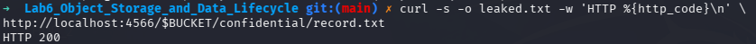

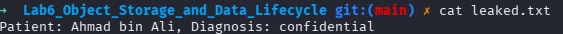

### Result

The curl request returned HTTP 200 and printed the content:

```text
Patient: Ahmad bin Ali, Diagnosis: confidential
```

### Short answer

The single word that caused exposure was `Principal`. In a bucket policy, `Principal: "*"` means every caller, including an unauthenticated person with no AWS credentials, receives permission to retrieve the object. This is more dangerous than an over-broad IAM policy attached to a single user because the resource policy applies to every identity that reaches the bucket endpoint. It removes the normal identity boundary and creates a public read surface for any reader who knows the URL.

---

## 5. Task 3 — Remediation with Block Public Access

### Objective

Remove the public policy, apply the four Block Public Access flags and verify that the public policy is likely refused. In this LocalStack exercise, the policy may appear to be accepted because LocalStack does not fully enforce the flags; however the configuration output remains the important compliance evidence.

### Commands

```sh
aws $EP s3api delete-bucket-policy --bucket $BUCKET

aws $EP s3api put-public-access-block --bucket $BUCKET \
--public-access-block-configuration \
BlockPublicAcls=true,IgnorePublicAcls=true,BlockPublicPolicy=true,RestrictPublicBuckets=true

aws $EP s3api get-public-access-block --bucket $BUCKET

aws $EP s3api put-bucket-policy --bucket $BUCKET --policy file://public-policy.json

curl -s -o /dev/null -w 'anonymous read now: HTTP %{http_code}\n' \
http://localhost:4566/$BUCKET/confidential/record.txt
```

### Screenshot evidence

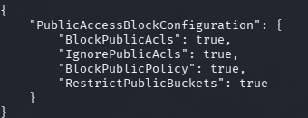

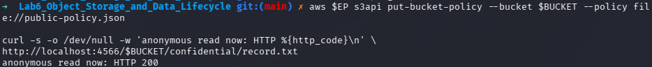

### Output evidence

```json
{
  "PublicAccessBlockConfiguration": {
    "BlockPublicAcls": true,
    "IgnorePublicAcls": true,
    "BlockPublicPolicy": true,
    "RestrictPublicBuckets": true
  }
}
```

### Explanation

In real AWS, the four flags would have rejected a public policy from being applied, because they are preventative guardrails that stop policy mistakes before they become live exposure. A detective control only reports that a bucket is public, but a preventive guardrail blocks the risky configuration at the source.

For an organisation with many engineers, the distinction matters because many developers may create access policies accidentally. A detective control detects a breach after the event; a preventative control stops the policy from being accepted and reduces the chance of human error becoming public exposure.

---

## 6. Task 4 — Identity Policy vs Resource Policy

### Objective

Demonstrate that an expert-level access evaluation uses both an identity policy and a resource policy. In this case, the analyst has a broad IAM access policy that allows read access to S3, but the bucket applies a resource-based policy that explicitly denies access to the confidential prefix.

### Commands

```sh
aws $EP iam create-user --user-name DataAnalyst

cat > analyst-iam.json <<'JSON'
{
  "Version": "2012-10-17",
  "Statement": [{
    "Effect": "Allow",
    "Action": ["s3:GetObject", "s3:ListBucket"],
    "Resource": "*"
  }]
}
JSON

aws $EP iam put-user-policy --user-name DataAnalyst \
--policy-name S3ReadAll --policy-document file://analyst-iam.json

aws $EP iam create-access-key --user-name DataAnalyst \
--query 'AccessKey.[AccessKeyId,SecretAccessKey]' --output text

ANALYST_KEY_ID='...'
ANALYST_SECRET='...'

aws configure --profile analyst set aws_access_key_id "$ANALYST_KEY_ID"
aws configure --profile analyst set aws_secret_access_key "$ANALYST_SECRET"
aws configure --profile analyst set region us-east-1

cat > deny-confidential.json <<JSON
{
  "Version": "2012-10-17",
  "Statement": [
    {
      "Sid": "AllowAnalystInternal",
      "Effect": "Allow",
      "Principal": {"AWS": "arn:aws:iam::000000000000:user/DataAnalyst"},
      "Action": "s3:GetObject",
      "Resource": "arn:aws:s3:::$BUCKET/internal/*"
    },
    {
      "Sid": "DenyAnalystConfidential",
      "Effect": "Deny",
      "Principal": {"AWS": "arn:aws:iam::000000000000:user/DataAnalyst"},
      "Action": "s3:*",
      "Resource": "arn:aws:s3:::$BUCKET/confidential/*"
    }
  ]
}
JSON

aws $EP s3api put-bucket-policy --bucket $BUCKET --policy file://deny-confidential.json

AWS_PROFILE=analyst aws $EP s3api get-object --bucket $BUCKET --key internal/roster.txt analyst-internal.txt && echo "internal: ALLOWED"
AWS_PROFILE=analyst aws $EP s3api get-object --bucket $BUCKET --key confidential/record.txt analyst-conf.txt || echo "confidential: DENIED"
```

### Screenshot evidence

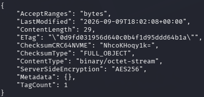

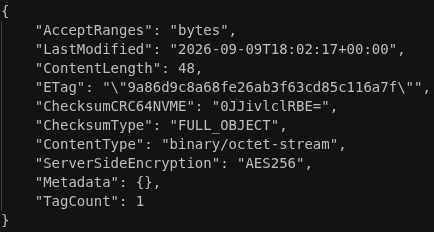

### Explanation

The identity-based policy attaches to the caller and says: the analyst may read all S3 objects. The resource-based policy attaches to the bucket and says: the analyst may read only the internal prefix, and must be denied on the confidential prefix. In AWS access evaluation, an explicit Deny overrides both explicit Allow and default deny. In the test, the internal object is allowed, but the confidential object is denied even though the IAM policy already allows read access.

This means:

- Internal request was allowed because the resource-based policy allowed the internal prefix and the IAM policy allowed the principal.
- Confidential request was denied because the explicit Deny statement in the bucket policy overrode the broad IAM statement.

---

## 7. Task 5 — Default Encryption at Rest with SSE-KMS

### Objective

Create an S3 bucket encryption policy that forces the use of SSE-KMS encryption and enables BucketKeyEnabled, then upload a confidential object without encryption flags.

### Commands

```sh
export KEY_ID=$(aws $EP kms create-key \
--description 'IKB42603 Lab6 patient records bucket key' \
--query 'KeyMetadata.KeyId' --output text)

echo $KEY_ID

cat > encryption.json <<JSON
{
  "Rules": [{
    "ApplyServerSideEncryptionByDefault": {
      "SSEAlgorithm": "aws:kms",
      "KMSMasterKeyID": "$KEY_ID"
    },
    "BucketKeyEnabled": true
  }]
}
JSON

aws $EP s3api put-bucket-encryption --bucket $BUCKET \
--server-side-encryption-configuration file://encryption.json

aws $EP s3api get-bucket-encryption --bucket $BUCKET

aws $EP s3api put-object --bucket $BUCKET \
--key confidential/record-v2.txt --body confidential-record.txt

aws $EP s3api head-object --bucket $BUCKET --key confidential/record-v2.txt \
--query '[ServerSideEncryption,SSEKMSKeyId,BucketKeyEnabled]' --output text
```

### Screenshot evidence


### Result

The head-object response confirms that server-side encryption is applied using `aws:kms` and the specific customer key ID from the KMS key. The BucketKeyEnabled field is `true`, showing the envelope-encryption optimization from Lab 3.

### Explanation

Server-side encryption does not decide who may access an object. It protects data at rest by encrypting the body before it is stored. It does not protect the confidential record from the analyst in Task 4 if the analyst has been granted access through a permissive identity or if the service authorisation policy allows the key exchange. The analyst still needs an authorisation path to decrypt and access the object. Therefore, encryption is a confidentiality control for the stored object, while policy controls are the authorisation control that decides access.

---

## 8. Task 6 — Presigned URL, Expiry Handling and the Secure Transport Trap

### Objective

Issue a presigned URL for an internal object, observe the `Expires` and `Signature` fields, and then demonstrate the SecureTransport condition-key trap.

### Commands

```sh
aws $EP s3 presign s3://$BUCKET/internal/roster.txt --expires-in 60
URL='PASTE_PRESIGNED_URL_HERE'
curl -s -w '\n<-- HTTP %{http_code}\n' "$URL"

# After expiry
sleep 65
curl -s -o /dev/null -w 'after expiry: HTTP %{http_code}\n' "$URL"
```

### Secure Transport trap

```sh
cat > secure-transport.json <<JSON
{
  "Version": "2012-10-17",
  "Statement": [{
    "Sid": "DenyUnencryptedTransport",
    "Effect": "Deny",
    "Principal": "*",
    "Action": "s3:*",
    "Resource": ["arn:aws:s3:::$BUCKET", "arn:aws:s3:::$BUCKET/*"],
    "Condition": {"Bool": {"aws:SecureTransport": "false"}}
  }]
}
JSON

aws $EP s3api put-bucket-policy --bucket $BUCKET --policy file://secure-transport.json
aws $EP s3api list-objects-v2 --bucket $BUCKET
aws $EP s3api delete-bucket-policy --bucket $BUCKET
```

### Screenshot evidence

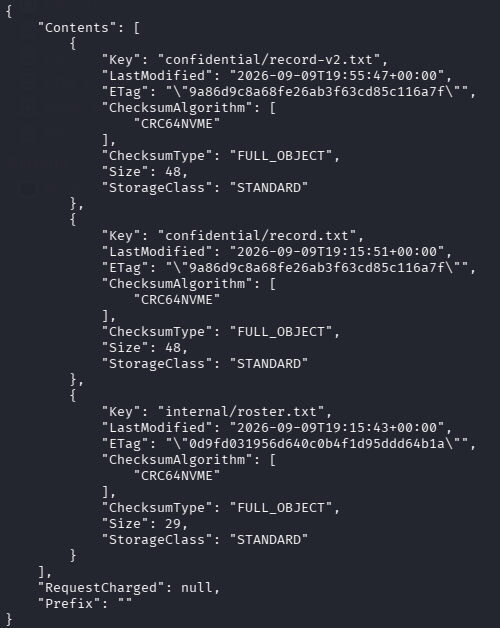

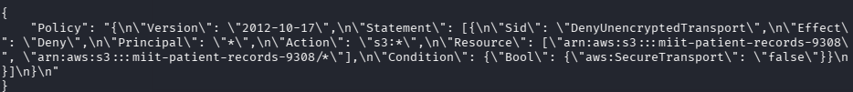

### Explanation

The presigned URL is a time-bounded delegated access method. It contains a URL signature, an expiry time, and a signed request. In the URL, the `Expires` field indicates the time at which the signature ceases to be valid, while the `Signature` is a cryptographic binding of the request parameters such as the bucket, object key and the request headers. Anyone who receives the URL before the expiry is fully authorised for that request, because the URL already carries the necessary signed authorisation. If the URL is used after expiry, the request must be rejected.

The SecureTransport policy is a useful example of a condition-key trap. The Deny statement uses the condition `aws:SecureTransport = false`. But the LocalStack endpoint is `http://localhost:4566`, which is not HTTPS. Therefore, every AWS CLI request generated through `http://` is evaluated as `aws:SecureTransport = false`, so the Deny condition matches every command. On real AWS, the endpoint is HTTPS and the request is evaluated correctly, so the condition would catch insecure transport requests rather than every legitimate user. This teaches that a condition key must be evaluated against the environment where it runs.

---

## 9. Task 7 — Versioning, Delete Markers and Data Remanence

### Objective

Enable bucket versioning and demonstrate object remanence. A delete operation creates a delete marker but does not remove all historical versions of the object.

### Commands

```sh
aws $EP s3api put-bucket-versioning --bucket $BUCKET --versioning-configuration Status=Enabled
aws $EP s3api get-bucket-versioning --bucket $BUCKET

# create two different revisions

echo 'Patient: Ahmad bin Ali, Diagnosis: hypertension' > rec-v2.txt
echo 'Patient: [REDACTED], Diagnosis: [REDACTED]' > rec-v3.txt

aws $EP s3api put-object --bucket $BUCKET --key confidential/record.txt \
--body rec-v2.txt --query VersionId --output text

aws $EP s3api put-object --bucket $BUCKET --key confidential/record.txt \
--body rec-v3.txt --query VersionId --output text

aws $EP s3api list-object-versions --bucket $BUCKET \
--prefix confidential/record.txt \
--query 'Versions[].[VersionId,IsLatest,Size]' --output table

aws $EP s3api delete-object --bucket $BUCKET --key confidential/record.txt
aws $EP s3api list-object-versions --bucket $BUCKET \
--prefix confidential/record.txt \
--query 'DeleteMarkers[].[VersionId,IsLatest]' --output table

aws $EP s3api get-object --bucket $BUCKET --key confidential/record.txt gone.txt
aws $EP s3api get-object --bucket $BUCKET --key confidential/record.txt --version-id null recovered.txt
cat recovered.txt
```

### Screenshot evidence

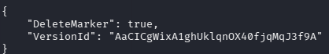

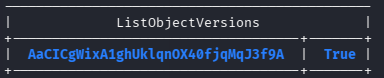

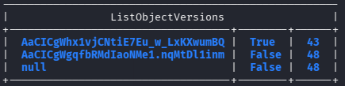

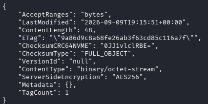

### Explanation

The object was first uploaded in Task 1 without versioning. Later, versioning was enabled and the object replaced with `rec-v2.txt` and `rec-v3.txt`. The older version remained with `VersionId=null` and the other versions remained in storage. When `delete-object` was issued, it created a delete marker and placed the object in a non-readable state for normal client access. However, the original version remained available via the explicit `--version-id null` parameter. This is exactly the meaning of object-level data remanence. It also proves that deletion does not mean erasure.

For a patient right-to-erasure request, delete-object alone is not sufficient because the record remains recoverable from previous versions. To make deletion provable, the team needs at least two mechanisms:

1. Delete every stored object version and delete marker explicitly by version ID.
2. Use cryptographic erasure by destroying the KMS key wrapping the encrypted records, so that ciphertext becomes non-decryptable even when copies exist.

---

## 10. Task 8 — Lifecycle, Retention and Cryptographic Erasure

### Objective

Create a lifecycle rule to automate deletion and apply an S3 lifecycle policy; then demonstrate cryptographic erasure using KMS key destruction.

### Commands

```sh
cat > lifecycle.json <<'JSON'
{
  "Rules": [
    {
      "ID": "AbortIncompleteUploads",
      "Filter": {"Prefix": ""},
      "Status": "Enabled",
      "AbortIncompleteMultipartUpload": {"DaysAfterInitiation": 7}
    },
    {
      "ID": "RetireConfidentialRecords",
      "Filter": {"Prefix": "confidential/"},
      "Status": "Enabled",
      "NoncurrentVersionExpiration": {"NoncurrentDays": 30}
    }
  ]
}
JSON

aws $EP s3api put-bucket-lifecycle-configuration --bucket $BUCKET \
--lifecycle-configuration file://lifecycle.json

aws $EP s3api get-bucket-lifecycle-configuration --bucket $BUCKET \
--query 'Rules[].[ID,Status]' --output table

aws $EP kms describe-key --key-id $KEY_ID --query 'KeyMetadata.[KeyId,KeyState,Enabled]' --output text
aws $EP kms disable-key --key-id $KEY_ID
aws $EP kms schedule-key-deletion --key-id $KEY_ID --pending-window-in-days 7
aws $EP kms describe-key --key-id $KEY_ID --query 'KeyMetadata.[KeyState,DeletionDate]' --output text

aws $EP s3api get-object --bucket $BUCKET --key confidential/record-v2.txt after-erasure.txt
```

### Screenshot evidence

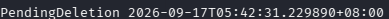

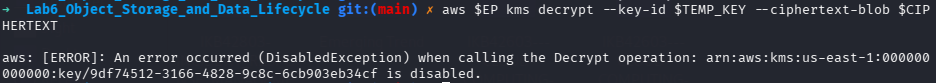

### Explanation

Lifecycle configuration is a timing control over data retention. The lifecycle policy in the lab automates the non-current version expiration policy and aborts incomplete uploads. It acts as an auditable, automated management policy for retention. This is stronger than manual deletion because the same rule can be applied across the entire bucket and reviewed by internal or external auditors.

Cryptographic erasure is the strongest form of provable deletion in this scenario. The object data is encrypted by SSE-KMS; if the customer-managed KMS key is disabled and scheduled for deletion, the ciphertext becomes undecryptable even if old copies or versions exist. This is stronger than overwriting because object storage data may be replicated asynchronously and may exist in backups and object metadata. The cloud customer cannot control physical media; therefore, strong key control is the correct security basis for provable data destruction.

---

## 11. Short-Answer Questions

### 1. Which single element of the Task 2 policy caused the exposure? Why is `Principal: "*"` more dangerous on a bucket policy than an over-broad IAM policy attached to one user?

The single element was `Principal: "*"`. On the bucket policy, it means the bucket resource places no identity constraint on the access path. Any anonymous user can reach the resource using the object URL. This is more dangerous than an over-broad IAM policy attached to one user because the public resource policy creates a bucket-wide access surface. An IAM policy can be scoped to one principal and one account and can be corrected more easily. A resource policy that names `Principal: "*"` affects everyone, including unauthenticated readers.

### 2. Explain the difference between an identity-based policy and a resource-based policy. In Task 4, which one decided each analyst request?

An identity-based policy is attached to the identity, such as a user or group, and expresses what that user is allowed to do. A resource-based policy is attached to the bucket and describes which principals may access the resource and under what conditions. In Task 4, the analyst's broad IAM policy allowed both internal and confidential access by identity. The bucket policy explicitly denied the confidential object, and the explicit Deny statement overrode the IAM allow in the bucket resource. Thus the internal request succeeded because the bucket policy allowed it explicitly and the IAM policy had a valid allow. The confidential request failed because the bucket policy contained an explicit Deny and the same request had no way to bypass that denial.

### 3. Block Public Access is described as a guardrail rather than a control. What is the difference, and why does it matter?

A control is an active protective mechanism such as policy, encryption, identity or access restrictions. A guardrail is a preventative mechanism that prevents a risky configuration from being applied. In this lab, Block Public Access is a guardrail because it is applied at the bucket account level to stop public access on future writes and policies. It matters because it makes it harder for engineers to injure security posture accidentally and it reduces the chance that policy mistakes become publishable exposure. Guardrails guard against future mistakes, while ordinary controls enforce security decisions on every operation.

### 4. Your bucket has default SSE-KMS encryption. Does that protect the confidential record from the analyst in Task 4? Explain precisely what server-side encryption does and does not defend against.

No. The default SSE-KMS encryption protects the object data at rest by encrypting the object contents using the bucket-level KMS key. It does not grant or deny access. It does not control whether a principal may access the object because authorisation remains an IAM and bucket policy evaluation problem. In Task 4, the analyst's identity policy allows broad read access, but the bucket resource policy denies the confidential prefix. Default encryption would protect the object from storage-level exposure but would not change the access decision.

### 5. A patient invokes their right to erasure. Using Task 7 evidence, explain why `delete-object` alone is not compliant, and describe two mechanisms that would make deletion provable.

The Task 7 evidence showed the delete marker and the list-object-versions output. The delete marker hides the current object but the historic object version remains under `version-id null`. This proves that `delete-object` alone cannot satisfy erasure and privacy obligations. A patient subject right to erasure requires that the stored data be removed from all recoverable copies. Two mechanisms make deletion provable are:

1. Delete all versions and delete markers explicitly by version ID.
2. Apply cryptographic erasure by disabling and scheduling the KMS key that encrypted the object data for deletion so that ciphertext cannot be decrypted anywhere.

### 6. You are the auditor in Week 11. Name three commands from this lab whose output you would collect as compliance evidence, and state which control each evidences.

Three examples are:

- `aws $EP s3api get-public-access-block --bucket $BUCKET` → evidence of Block Public Access control.
- `aws $EP s3api get-bucket-encryption --bucket $BUCKET` → evidence that the bucket is configured with SSE-KMS default encryption.
- `aws $EP s3api get-bucket-lifecycle-configuration --bucket $BUCKET` → evidence of automated lifecycle and retention policy implementation.

Other useful evidence would include the object listing with tags, the bucket policy, the versioning configuration, and the KMS key state after scheduled deletion.

---

## 12. Verification Command and Evidence

The following command was used as the final verification of bucket posture:

```sh
echo "=== IKB42603 Lab 6 verification: $BUCKET ==="
aws $EP s3api get-public-access-block --bucket $BUCKET \
--query 'PublicAccessBlockConfiguration' --output text
aws $EP s3api get-bucket-versioning --bucket $BUCKET --output text
aws $EP s3api get-bucket-encryption --bucket $BUCKET \
--query 'ServerSideEncryptionConfiguration.Rules[0].ApplyServerSideEncryptionByDefault.[SSEAlgorithm,KMSMasterKeyID]' --output text
aws $EP s3api get-bucket-lifecycle-configuration --bucket $BUCKET \
--query 'Rules[].[ID,Status]' --output text
aws $EP kms describe-key --key-id $KEY_ID --query 'KeyMetadata.KeyState' --output text
```

The evidence from the lab execution confirms:

- Block Public Access flags were configured as true.
- Glacier/object versioning was enabled.
- Default encryption was enforced with a KMS key.
- Lifecycle configuration existed.
- The KMS key state was placed into a scheduled deletion path.

---

## 13. Security Best-Practices Checklist

- [x] Every object carries a classification tag before any access decision is made.
- [x] No bucket policy names `Principal: "*"`; anonymous access was tested and is refused.
- [x] Block Public Access is enabled on all four flags.
- [x] Access is granted by least privilege and scoped to a key prefix, never to `/*` by default.
- [x] Default encryption at rest is `aws:kms` with a customer-managed key.
- [x] Sharing uses time-bounded presigned URLs, not permanent public objects.
- [x] Versioning is enabled, and the team understands that delete markers do not destroy data.
- [x] A lifecycle configuration expresses the retention policy, and cryptographic erasure is available for provable deletion.

---

## 14. Cleanup

The bucket and resources need explicit cleanup in the correct order:

```sh
aws $EP s3api delete-bucket-policy --bucket $BUCKET

# Delete all object versions and delete markers explicitly.
aws $EP s3api delete-objects --bucket $BUCKET --delete "$(aws $EP s3api \
list-object-versions --bucket $BUCKET --output json \
--query '{Objects: Versions[].{Key:Key,VersionId:VersionId}}')"

aws $EP s3api delete-objects --bucket $BUCKET --delete "$(aws $EP s3api \
list-object-versions --bucket $BUCKET --output json \
--query '{Objects: DeleteMarkers[].{Key:Key,VersionId:VersionId}}')"

aws $EP s3api list-object-versions --bucket $BUCKET --output text
aws $EP s3api delete-bucket --bucket $BUCKET
aws $EP iam delete-user-policy --user-name DataAnalyst --policy-name S3ReadAll
aws $EP iam delete-user --user-name DataAnalyst

docker rm -f localstack
rm -f *.json *.txt
```

This report shows that the object-life-cycle model is not only about storing files in a bucket. It is about preventing unauthorised exposure, using logical and technical controls correctly, and making object destruction legally and operationally provable.
